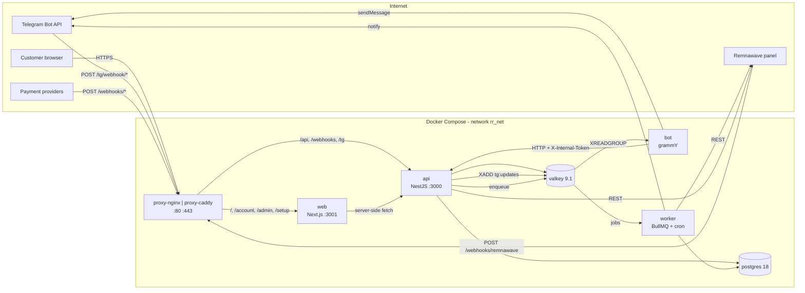

# RemnaRay

[](https://github.com/VAQYBIN/remnaray-astra/actions/workflows/ci.yml)
[](https://github.com/VAQYBIN/remnaray-astra/releases)
[](LICENSE)

**Open-source commerce platform for Remnawave.**
[Русская версия](README.ru.md)

## What this is

RemnaRay sells the subscriptions of one Remnawave panel through two channels at
once: a Telegram bot and a website with a landing page and a customer account.
Both are thin clients over one API, so a price, a promo code or a referral rule
exists once and behaves identically wherever a customer meets it. The shop is
run from its own administration console.

It is built for the owner who has a VPS, a panel and no wish to read code.
Everything except secrets and infrastructure lives in the database and is
edited in the console: plans, texts, the theme, payment providers, the referral
programme, the bot's mode. The first run is a web wizard of eight steps, not a
file of forty environment variables.

Changing the brand is not a fork. The theme and every message are data — copy
`themes/manta`, change the colours, select it, and upgrades keep working. The
proxy is one variable: nginx, Caddy or your own, with the same routes, statuses
and security headers either way, which a smoke test proves on every pull
request.

## Quick start

```sh
git clone https://github.com/VAQYBIN/remnaray-astra && cd remnaray-astra
./scripts/init-env.sh          # asks for the domain, the email and a password
./scripts/rr up                # starts the profile named in .env
docker compose ps              # everything healthy, `migrate` exited 0
```

Then open `https://<your domain>/setup`, paste the token `init-env.sh` printed,
and walk the wizard: administrator and TOTP, panel, bot, brand, the first plan
and the trial, payments, finish. `/setup` answers 404 afterwards.

Target: under thirty minutes from the first command to a bot that sells.
[`docs/install.md`](docs/install.md) is the long version.

## Requirements

|                  | Minimum                                                      | Recommended           |
| ---------------- | ------------------------------------------------------------ | --------------------- |
| CPU / RAM / disk | 1 vCPU / 2 GB / 20 GB                                        | 2 vCPU / 4 GB / 40 GB |
| OS               | Ubuntu 22.04+ / Debian 12+, Docker Engine 27+, Compose 2.20+ | Ubuntu 24.04 LTS      |
| Ports            | `80/tcp`, `443/tcp`, `443/udp` (optional)                    | and `22`              |
| Panel            | Remnawave 2.8.0+ with an API token                           |                       |
| Telegram         | a bot token from [@BotFather](https://t.me/BotFather)        |                       |

## Proxy profiles

| `RR_PROXY_PROFILE` | TLS                                 | Who owns 80/443 | Use it when                                                     |
| ------------------ | ----------------------------------- | --------------- | --------------------------------------------------------------- |
| `nginx` (default)  | ACME module, certbot, or your files | RemnaRay        | nothing else on the server needs those ports                    |
| `caddy`            | Caddy's own ACME, or your files     | RemnaRay        | you prefer Caddy, or want HTTP/3 without thinking about it      |
| `external`         | none                                | you             | an existing nginx, Traefik or Cloudflare already terminates TLS |

The routes, the statuses, the security headers and the forwarded headers are
identical across profiles — section 21.5, checked by
[`deploy/ci/proxy-smoke.sh`](deploy/ci/proxy-smoke.sh) on both. See
[`docs/proxy.md`](docs/proxy.md), [`docs/tls.md`](docs/tls.md) and
[`docs/external-proxy.md`](docs/external-proxy.md).

## Payment providers

| Provider                                | Fiscal receipts | Who can sign up                     |
| --------------------------------------- | --------------- | ----------------------------------- |
| [YooKassa](docs/payments/yookassa.md)   | yes             | company, sole trader, self-employed |
| [Robokassa](docs/payments/robokassa.md) | yes             | company, sole trader, self-employed |
| [Lava](docs/payments/lava.md)           | yes             | company, sole trader                |
| [Platega](docs/payments/platega.md)     | no              | selling without a status            |
| [CryptoBot](docs/payments/cryptobot.md) | no              | anyone                              |
| Telegram Stars                          | no              | anyone with a bot                   |
| Account balance                         | n/a             | always available                    |

The wizard asks whether you are self-employed and offers only the providers
that fit. A provider is one class behind one interface, so adding another is a
contained job — the checklist is in
[`CONTRIBUTING.md`](CONTRIBUTING.md#adding-a-payment-provider), and
[`docs/payments/README.md`](docs/payments/README.md) covers what is already
there.

## Customisation without a fork

The theme is a directory of tokens and assets; the texts are JSON catalogs, and
any single message can be overridden from the console. Neither needs a rebuild
and neither is lost on upgrade.

- [`docs/theming.md`](docs/theming.md) — colours, logo, mascot, a theme of your own
- [`docs/i18n.md`](docs/i18n.md) — the texts, the legal documents, another language
- [`docs/admin.md`](docs/admin.md) — what the console can do

## Upgrading

```sh
git pull && docker compose pull && ./scripts/rr up
```

`compose.yaml` follows the major line, so a pull brings the current minor and
patch. Read the changelog section for the version you are moving to first: a
release that needs anything from you says so under **⚠ Breaking**, **Migration
notes** and **Downgrade path**. Details in
[`docs/upgrade.md`](docs/upgrade.md); backups in
[`docs/backup.md`](docs/backup.md).

## Compared with remnawave-tg-shop

[`remnawave-tg-shop`](https://github.com/Fr1ngg/remnawave-tg-shop) is the
FastAPI and aiogram shop many owners start with. It sells subscriptions in
Telegram and does it well. RemnaRay answers a different question — what a shop
needs once it is someone's business.

|                           | remnawave-tg-shop                                | RemnaRay                                                                                 |
| ------------------------- | ------------------------------------------------ | ---------------------------------------------------------------------------------------- |
| Configuration             | dozens of `.env` variables, validated at runtime | a web wizard; settings in the database, `.env` holds secrets only                        |
| Branding                  | edit the sources — that is, fork                 | theme and texts are data, overridable in the console                                     |
| Channels                  | Telegram                                         | Telegram **and** a website with a customer account, over one API                         |
| Payments                  | a branch per provider                            | one `PaymentProvider` interface, six implementations, an idempotent ledger               |
| Referrals and promo codes | limited or absent                                | three referral schemes, hold against refunds, promo codes with batch generation          |
| Proxy and TLS             | your problem                                     | generated from the wizard for nginx or Caddy, or step aside for yours                    |
| Money                     | floats in places                                 | integer minor units, double-entry ledger, audited                                        |
| Operations                | logs                                             | console with revenue and conversion, action journal, health, backups, Prometheus metrics |

If you want a bot that sells, that project is smaller and simpler. If you want
a shop you can hand to someone else to run, this one is built for it.

## Architecture

Three Node processes from one image, plus the site:



The bot never touches the database. One place holds the business rules, so the
validation, the audit trail and the idempotency are the same for the bot and
the site. [`docs/api.md`](docs/api.md) describes the surfaces;
[`docs/monitoring.md`](docs/monitoring.md) the metrics.

## Contributing

Read [`CONTRIBUTING.md`](CONTRIBUTING.md) — how to run it locally, how to add a
payment provider or a language, and what has to be true before a pull request
is ready. Conduct: [`CODE_OF_CONDUCT.md`](CODE_OF_CONDUCT.md). Security
problems go through [`SECURITY.md`](SECURITY.md), never a public issue.

## License

[MIT](LICENSE).
