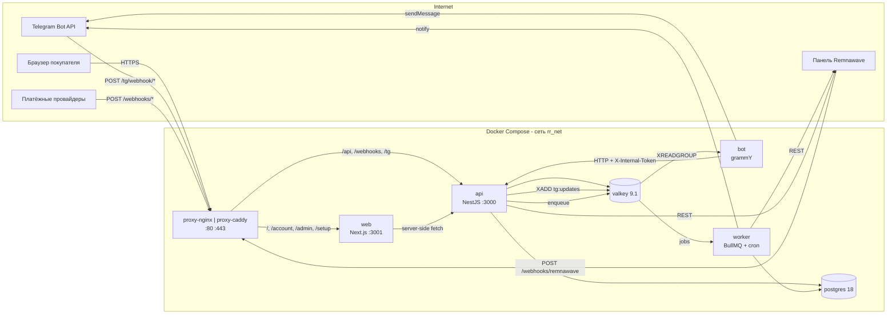

# RemnaRay

[](https://github.com/VAQYBIN/remnaray-astra/actions/workflows/ci.yml)
[](https://github.com/VAQYBIN/remnaray-astra/releases)
[](LICENSE)

**Open-source commerce platform for Remnawave.**
[English version](README.md)

## Что это

RemnaRay продаёт подписки одной панели Remnawave сразу через два канала:
Telegram-бот и сайт с лендингом и личным кабинетом. Оба — тонкие клиенты над
одним API, поэтому цена, промокод или реферальное правило существуют один раз и
работают одинаково, где бы покупатель с ними ни встретился. Магазином
управляют из собственной веб-админки.

Он сделан для владельца, у которого есть VPS, панель и нет желания читать код.
Всё, кроме секретов и инфраструктуры, лежит в базе и правится в админке: тарифы,
тексты, тема, платёжные провайдеры, реферальная программа, режим бота. Первый
запуск — веб-мастер из восьми шагов, а не файл из сорока переменных окружения.

Смена бренда — не форк. Тема и все сообщения являются данными: скопируйте
`themes/manta`, поменяйте цвета, выберите её — и обновления продолжат
приходить. Прокси — одна переменная: nginx, Caddy или ваш собственный, с
одинаковыми маршрутами, статусами и security-заголовками в любом случае, что
проверяется smoke-тестом на каждом pull request.

## Быстрый старт

```sh
git clone https://github.com/VAQYBIN/remnaray-astra && cd remnaray-astra
./scripts/init-env.sh          # спросит домен, email и пароль базы
./scripts/rr up                # поднимет профиль, указанный в .env
docker compose ps              # всё healthy, `migrate` завершился с 0
```

Дальше откройте `https://<ваш домен>/setup`, вставьте токен, который напечатал
`init-env.sh`, и пройдите мастер: администратор и TOTP, панель, бот, бренд,
первый тариф и триал, платежи, запуск. После этого `/setup` отвечает 404.

Цель — меньше тридцати минут от первой команды до бота, который продаёт.
Подробно: [`docs/install.md`](docs/install.md).

## Требования

|                  | Минимум                                                      | Рекомендуется         |
| ---------------- | ------------------------------------------------------------ | --------------------- |
| CPU / RAM / диск | 1 vCPU / 2 ГБ / 20 ГБ                                        | 2 vCPU / 4 ГБ / 40 ГБ |
| ОС               | Ubuntu 22.04+ / Debian 12+, Docker Engine 27+, Compose 2.20+ | Ubuntu 24.04 LTS      |
| Порты            | `80/tcp`, `443/tcp`, `443/udp` (опционально)                 | и `22`                |
| Панель           | Remnawave 2.8.0+ с API-токеном                               |                       |
| Telegram         | токен бота от [@BotFather](https://t.me/BotFather)           |                       |

## Профили прокси

| `RR_PROXY_PROFILE`     | TLS                                   | Кто владеет 80/443 | Когда брать                                                     |
| ---------------------- | ------------------------------------- | ------------------ | --------------------------------------------------------------- |
| `nginx` (по умолчанию) | ACME-модуль, certbot или ваши файлы   | RemnaRay           | на сервере больше ничего не занимает эти порты                  |
| `caddy`                | собственный ACME Caddy или ваши файлы | RemnaRay           | вам ближе Caddy или нужен HTTP/3 без лишних размышлений         |
| `external`             | нет                                   | вы                 | уже есть nginx, Traefik или Cloudflare, который терминирует TLS |

Маршруты, статусы, security-заголовки и проброшенные заголовки одинаковы во
всех профилях — раздел 21.5, проверяется
[`deploy/ci/proxy-smoke.sh`](deploy/ci/proxy-smoke.sh) на обоих. См.
[`docs/proxy.md`](docs/proxy.md), [`docs/tls.md`](docs/tls.md) и
[`docs/external-proxy.md`](docs/external-proxy.md).

## Платёжные провайдеры

| Провайдер                               | Чеки | Кто может подключить |
| --------------------------------------- | ---- | -------------------- |
| [ЮKassa](docs/payments/yookassa.md)     | да   | ООО, ИП, самозанятый |
| [Robokassa](docs/payments/robokassa.md) | да   | ООО, ИП, самозанятый |
| [Lava](docs/payments/lava.md)           | да   | ООО, ИП              |
| [Platega](docs/payments/platega.md)     | нет  | продажа без статуса  |
| [CryptoBot](docs/payments/cryptobot.md) | нет  | кто угодно           |
| Telegram Stars                          | нет  | у кого есть бот      |
| Баланс аккаунта                         | —    | всегда доступен      |

Мастер спрашивает, самозанятый ли вы, и предлагает только подходящие
провайдеры. Провайдер — это один класс за одним интерфейсом, поэтому добавить
ещё один — ограниченная задача: чеклист в
[`CONTRIBUTING.md`](CONTRIBUTING.md#adding-a-payment-provider), а про уже
готовые — [`docs/payments/README.md`](docs/payments/README.md).

## Кастомизация без форка

Тема — каталог токенов и ассетов, тексты — JSON-каталоги, и любое отдельное
сообщение можно переопределить из админки. Ни то ни другое не требует пересборки
и не теряется при обновлении.

- [`docs/theming.md`](docs/theming.md) — цвета, логотип, маскот, своя тема
- [`docs/i18n.md`](docs/i18n.md) — тексты, юридические документы, новый язык
- [`docs/admin.md`](docs/admin.md) — что умеет админка

## Обновление

```sh
git pull && docker compose pull && ./scripts/rr up
```

`compose.yaml` следует мажорной линии, поэтому `pull` приносит текущие минор и
патч. Сначала прочитайте раздел CHANGELOG для версии, на которую переходите:
релиз, который чего-то от вас требует, говорит об этом в разделах
**⚠ Breaking**, **Migration notes** и **Downgrade path**. Подробно —
[`docs/upgrade.md`](docs/upgrade.md), про бэкапы —
[`docs/backup.md`](docs/backup.md).

## Сравнение с remnawave-tg-shop

[`remnawave-tg-shop`](https://github.com/Fr1ngg/remnawave-tg-shop) — магазин на
FastAPI и aiogram, с которого начинают многие владельцы. Он продаёт подписки в
Telegram и делает это хорошо. RemnaRay отвечает на другой вопрос: что нужно
магазину, когда он стал чьим-то делом.

|                      | remnawave-tg-shop                                 | RemnaRay                                                                               |
| -------------------- | ------------------------------------------------- | -------------------------------------------------------------------------------------- |
| Настройка            | десятки переменных `.env`, проверяются в рантайме | веб-мастер; настройки в базе, в `.env` только секреты                                  |
| Брендирование        | правка исходников, то есть форк                   | тема и тексты — данные, переопределяются в админке                                     |
| Каналы               | Telegram                                          | Telegram **и** сайт с кабинетом, над одним API                                         |
| Платежи              | ветка `if` на провайдера                          | один интерфейс `PaymentProvider`, шесть реализаций, идемпотентный журнал               |
| Рефералы и промокоды | ограниченно или нет                               | три реферальные схемы, удержание под возвраты, промокоды с пакетной генерацией         |
| Прокси и TLS         | ваша забота                                       | генерируются мастером для nginx или Caddy — либо уступают место вашему                 |
| Деньги               | местами float                                     | целые минорные единицы, двойная запись, сверка                                         |
| Эксплуатация         | логи                                              | админка с выручкой и конверсией, журнал действий, здоровье, бэкапы, метрики Prometheus |

Если нужен бот, который продаёт, тот проект меньше и проще. Если нужен магазин,
который можно отдать другому человеку в управление, этот сделан для такого.

## Архитектура

Три Node-процесса из одного образа плюс сайт:



Бот никогда не ходит в базу напрямую. Бизнес-правила лежат в одном месте,
поэтому валидация, аудит и идемпотентность одинаковы для бота и для сайта.
Поверхности API — [`docs/api.md`](docs/api.md), метрики —
[`docs/monitoring.md`](docs/monitoring.md).

## Вклад

Читайте [`CONTRIBUTING.md`](CONTRIBUTING.md): как запустить локально, как
добавить платёжного провайдера или язык и что должно быть верно до того, как
pull request готов. Правила общения — [`CODE_OF_CONDUCT.md`](CODE_OF_CONDUCT.md).
О проблемах безопасности — через [`SECURITY.md`](SECURITY.md), никогда не в
публичном issue.

## Лицензия

[MIT](LICENSE).
